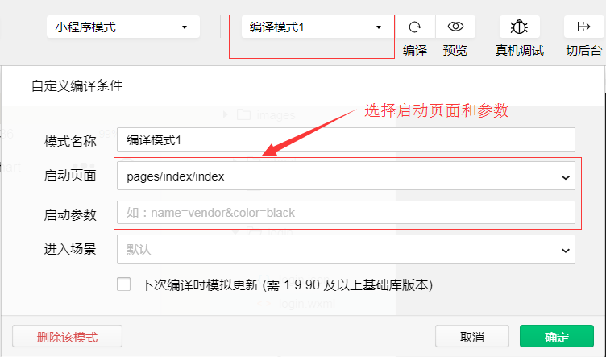
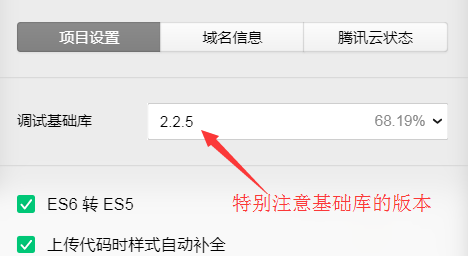

# 微信小程序开发-基础

## 今天知识点 

1.什么是小程序
2.小程序和web网页的区别
3.小程序环境搭建
4.创建小程序
5.开发工具功能介绍
6.小程序的文件结构
7.小程序的组件
8.小程序样式
9.小程序生命周期

## 1.什么是小程序
小程序是一种不需要下载、安装即可使用的应用，它实现了触手可及的梦想，用户扫一扫或者搜一下就能打开应用，也实现了用完即走的理念，用户不用安装太多应用，应用随处可用，但又无须安装卸载

## 2.小程序和web网页的区别
小程序和网页是两个完全独立的东西，只是开发模式比较相似，都使用前端的开发技术

## 3.小程序环境搭建

### 账号注册

百度搜索 "微信公众平台"
官网地址： https://mp.weixin.qq.com/
微信公众平台小程序注册地址：https://mp.weixin.qq.com/wxopen/waregister?action=step1&token=&lang=zh_CN

**注册时主体类型选择**


```
注意：注册小程序使用的邮箱账号不能和订阅号或者服务号的重复，也就是假如该邮箱账号注册过订阅号或者服务号，就不能用来注册小程序账号了，推荐注册一个新的邮箱账号，
```

## 4.创建小程序

**1.下载开发工具**
开发工具下载地址：https://developers.weixin.qq.com/miniprogram/dev/devtools/download.html

**2.获取appid**
小程序的appid相当于小程序平台的一个身份证，很多地方需要用到appid，比如在创建小程序项目时候就需要用到appid

1.登录微信公众开发平台（地址见账号注册）
2.进入设置
3.切换到开发设置


**3.创建第一个小程序项目**
打开微信开发者工具，根据下面提示填写项目信息


点击右下角的确定按钮，创建项目成功

```
总结：
1. 账号注册，推荐使用新注册的邮箱，可以是163邮箱、新浪邮箱、qq邮箱等等
2. 个人开发者，注册时第三选择账号主体要选择个人
3. 获取appid，登录微信公众平台，选择左侧栏的设置，在右侧内容页切换到开发设置
4. 创建项目时需要输入上一步获取的appid
5. 选择启动模板： 选择快速启动模板
```

## 5.开发工具功能介绍

**1.新增和修改编译模式**
编译模式可以修改启动页和添加该页面的参数，新增界面如下图：



点击确定按钮，页面就会刷新并显示为当前设置的启动页

**2.预览和真机调试**
调试：开发者可以通过手机扫描预览提供的二维码来访问小程序
真机调试：和预览一样会提供访问的二维码，不同的是真机调试模式会弹出控制台，可以查看手机模式下的调试信息

**3.清除缓存**
清除本地的授权记录、sessionStorage和localStorage等缓存数据

**4.项目的详情设置**
通过顶部的菜单栏，选择 - 设置 - 项目设置，点击后有右侧打开项目设置面板


```
注意版本库的选择，不要轻易去修改这个配置，很容易导致项目的api不兼容
```

## 6.小程序文件结构

### 1.基本的结构
	- pages // 包含了所有页面
	- index // 页面文件夹
		- index.js    // 页面的脚本逻辑文件
		- index.wxml  // 页面模板文件
		- index.wxss  // 页面样式文件
		- index.json  // 页面配置文件
	- utils // 普通的工具函数
	- app.js   // 项目启动入口
	- app.json // 全局的配置
	- app.wxss // 全局样式
	- project.config.json // 项目的配置文件

和web的页面结构比较：

| 文件 | 小程序 |  web |
| ----- | ------- | ----- |
| 模板 | .wxml | .html |
| 样式 | .wxss | .css |
| 脚本 | .js | .js/script标签 |

```
注意：微信小程序页面目录下，.js 和  .wxml 文件是必需的
```

### 2.全局配置 app.json
app.json文件用来对微信小程序进行全局配置

**常见的属性：**
| 属性 | 类型 | 必填 | 描述 | 详细配置地址 |
| ---- | ---- | ---- | ---- | ---- |
| pages | String | 是 | 页面路径列表 | https://developers.weixin.qq.com/miniprogram/dev/framework/config.html#pages |
| window | Object | 否 | 全局的窗口样式 | https://developers.weixin.qq.com/miniprogram/dev/framework/config.html#window |
| tabBar | Object | 否 | 底部tab栏的配置 | https://developers.weixin.qq.com/miniprogram/dev/framework/config.html#tabBar |

**局部配置**

pages数组中的页面路径地址必须存在pages文件夹中

pages数组中的页面路径地址下标为0，也就是第一个路径在普通编译模式下会作为启动页面，但不建议使用更换顺序的方式修改启动页， 可以通过新增或修改编译模式更改启动页

**window配置示例**

	// app.json
	{
	  "window":{
	    "navigationBarBackgroundColor": "#fff", // 导航栏背景颜色 
	    "navigationBarTextStyle": "black",      // 导航栏标题颜色，仅支持 black / white
	    "navigationBarTitleText": "weChart",    // 导航栏标题文字内容
	    "backgroundColor": "#fff",				// 窗口的背景色
	    "backgroundTextStyle": "light"，			// 下拉 loading 的样式，仅支持 dark / light
	    "enablePullDownRefresh": true			// 设置允许下拉刷新
	  }
	}

```
注意： window的配置
1. navigationBarTextStyle导航栏标题颜色，仅支持 black / white 
2. backgroundTextStyle下拉 loading 的样式，仅支持 dark / light
```

**tabBar配置示例**

	// app.json
	{
	  "tabBar": {
	  	"color": "#000",					// tab 上的文字默认颜色
	  	"selectedColor": "#000",			// tab 上的文字选中时的颜色
	  	"backgroundColor": "#f5f5f5",		// tab 的背景色
	    "list": [{
	      "pagePath": "pages/index/index",	// 页面路径，必须在 pages 中先定义（必填）
	      "text": "首页",					// tab 上按钮文字（必填）
	      "iconPath": "",					// tab 上的图片路径,不支持网络图片
	      "selectedIconPath": ""			// 选中时的图片路径
	    }, {
	      "pagePath": "pages/logs/logs",
	      "text": "日志",
	      "iconPath": "",					
	      "selectedIconPath": ""		
	    }]
	  }
	}

```
注意：配置了tabBar后，底部栏只对配置的页面可见, 而且tabBar的设置至少两个，最多5个
```

### 3.页面配置

每一个小程序页面也可以使用.json文件来对本页面的窗口表现进行配置。
```
注意：页面的配置只能设置 app.json 中部分 window 配置项的内容，页面中配置项会覆盖 app.json 的 window 中相同的配置项。
```

## 7.小程序的组件

### 新建页面
通过app.json来新建

### wxml和html的不同点
标签名字不一样，如html里常用的标签 div、a、span等，在小程序里标签是view、navigator、text等

### view容器组件
view组价的基本使用
	<view class="container">
		<!-- 页面内容 -->
	</view>

### text文本组件
text的基本使用
	<view class="container">
		<!-- text组件 -->
		<text>文本内容</text>
	</view>

```
1. text组件内只支持 text 嵌套
2. 除了文本节点以外的其他节点都无法长按选中
```

### navigator页面链接组件
navigator的基本使用
	// url的连接前面必须加上斜杆 “/”
	<navigator url="/pages/demo/domo">
		跳转到demo
	</navigator>

```
注意：navigator不支持跳转到外部的url，例如url="https://www.baidu.com"
```

**跳转到tabBar的页面**
设置open-type值为switchTab，比如index页面是tabBar的页面，可以这样来设置

跳转到tabBar的使用方法

	<navigator url="/pages/index/index" open-type="switchTab">
		跳转到首页
	</navigator>

### image图片组件
image的基本使用

	<image 
		style="width: 200px; height: 200px;
		mode="aspectFill" 
		src="图片地址">
	</image>

```
注意：image组件默认宽度300px、高度240px 注2：image组件中二维码/小程序码图片不支持长按识别
```

图片的裁剪模式

**常用的mode 有效值**

- scaleToFill	不保持纵横比缩放图片，使图片的宽高完全拉伸至填满 image 元素
	 aspectFit		保持纵横比缩放图片，使图片的长边能完全显示出来
	 aspectFill	保持纵横比缩放图片，只保证图片的短边能完全显示出来

```
注意：微信朋友圈和QQ的说说页的图片裁剪方式，可以通过设置 `mode=aspectFill` 实现类似功能
```

### input组件
input的简单使用
	<input placeholder="请输入文字" type="text"/>

**input常用的属性**

| 属性 | 类型 | 默认值 | 说明 |
| ---- | ---- | ---- | ---- |
| value | String |  | 输入框的初始内容 |
| type | String | "text" | input 的类型 |
| password | Boolean | false | 是否是密码类型 |
| placeholder | String |  | 输入框为空时占位符 |
| disabled | Boolean | false | 是否禁用  |

**input type 有效值**
| 值 | 说明 |
| ---- | ---- |
| text | 文本输入键盘 |
| number | 数字输入键盘 |
| idcard | 身份证输入键盘 |
| digit | 带小数点的数字键盘 |

### button 按钮组件

**button常用的属性**

| 属性 | 类型 | 默认值 | 说明 |
| ---- | ---- | ---- | ---- |
| size | String | default | 按钮的大小 |
| type | String | default | 按钮的样式类型 |
| disabled | Boolean | false | 是否禁用 |
| loading | Boolean | false | 名称前是否带 loading 图标 |
| form-type | String |  | 用于form组件，可选值 submit/reset，触发form的提交和reset事件 |

### form表单组件
form表单基本提交案例

第一步，设置button form-type='submit 

第二步，通过bindsubmit设置form的提交事件处理函数 

	// wxml
	<form bindsubmit="formSubmit">
		<input type="text" name="username" placeholder></input>
		<button form-type="submit">提交</button>
	</form>
	
	// js
	formSubmit: function(e){
	    console.log(e.detail.value)
	}

## 8.小程序样式

WXSS 对 CSS 进行了扩充以及修改，与 CSS 相比，WXSS 扩展的特性有：

- 全局样式和局部样式
- 尺寸单位
- 样式导入

### 1.全局样式和局部样式
app.wxss是全局样式,page中的wxss是页面的局部样式

### 2.rpx 尺寸单位

**什么是rpx？**
rpx可以使元素根据屏幕宽度进行自适应，小程序规定屏幕的宽度为750rpx， 也就是 100% = 750rpx; 50% = (750 / 2)rpx

**其他自适应方法**
web中使用rem，vw, vh, 百分比

**使用方法**
在开发小程序是建议使用750像素宽度的设计稿，这样设计稿的元素宽度是多少像素就直接设置为多少rpx

```
注意1rpx在某些屏幕上可能无效
```

### 3.样式导入
通过`@import`导入外部的样式，常用语公共样式

```
总结：
1.wxss 不需要导入到wxml，在页面目录下创建即可生效
2.app.wxss是全局样式,page中的wxss是页面的局部样式
3.rpx 尺寸单位 
4.@import 样式导入
```


## 9.小程序生命周期

生命周期有程序的生命周期和页面的生命周期

### 1.程序的生命周期
文档地址：https://developers.weixin.qq.com/miniprogram/dev/framework/app-service/app.html

在程序入口`app.js`中调用App(),	而且必须调用且只能调用一次，然后再App()的参数中可以声明生命周期函数

**前台，后台的概念**

- 前台：打开微信就进入小程序前台
- 后台：当用户点击右上角关闭，或者按了设备 Home 键离开微信，此时小程序并没有直接销毁，而是进入了后台；

**常用的生命周期：**
| 属性 | 描述 | 触发时机 |
| ---- | ---- | -------- |
| onLaunch | 监听小程序初始化 | 小程序初始化完成时（全局只触发一次）|
| onShow | 监听小程序显示 | 小程序启动，或从后台进入前台显示时 |
| onHide | 监听小程序隐藏 | 小程序从前台进入后台时 |

**注意：小程序的运行机制**
- 小程序没有重启的概念
- 当小程序进入后台，客户端会维持一段时间的运行状态，超过一定时间后（目前是5分钟）会被微信主动销毁

### 2.页面的生命周期
页面需要通过Page(Object) 函数用来注册一个页面。接受一个 Object 类型参数，其指定页面的初始数据、生命周期回调、事件处理函数等。

文档地址：https://developers.weixin.qq.com/miniprogram/dev/framework/app-service/page.html

**常用的生命周期：**
| 属性 | 描述 |
| onLoad | 监听页面加载 |
| onShow | 监听页面显示 |
| onReady | 监听页面初次渲染完成 |
| onHide | 监听页面隐藏 |

**onLoad**
页面加载时触发。一个页面只会调用一次，可以在 onLoad 的参数中获取打开当前页面路径中的参数。

参数说明, 通过query获取当前页面路径中的参数

| 名称 | 类型 | 说明 |
| ---- | ---- | ---- |
| query | Object | 打开当前页面路径中的参数 |

```
注意：页面需要访问api接口来初始化页面， 都可以在onLoad中调用
```

## 总结：
- 程序的生命周期: app.js中onLaunch在小程序初始化中触发
- 页面的生命周期: onLoad 只在页面加载的时候执行一次, onShow每次访问页面都会执行, 通常onLoad在onShow之前执行


## 今天总结：
1.小程序和web网页的区别
2.小程序环境搭建
3.创建小程序
4.开发工具功能介绍
5.小程序的文件结构
6.小程序的组件
7.小程序样式
8.小程序生命周期